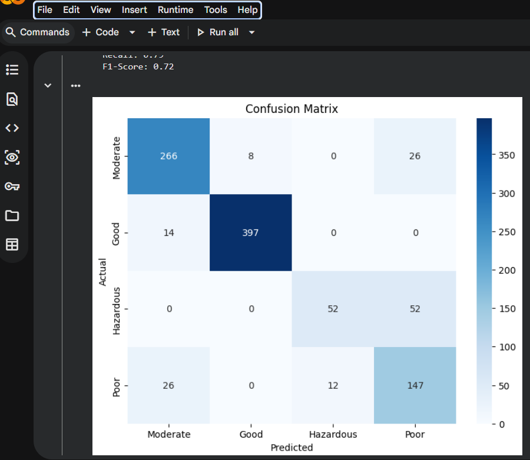
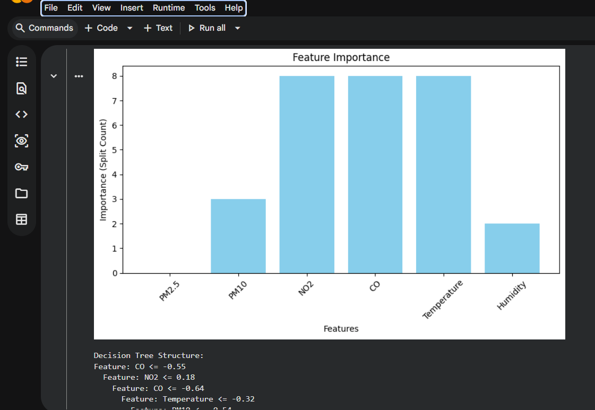
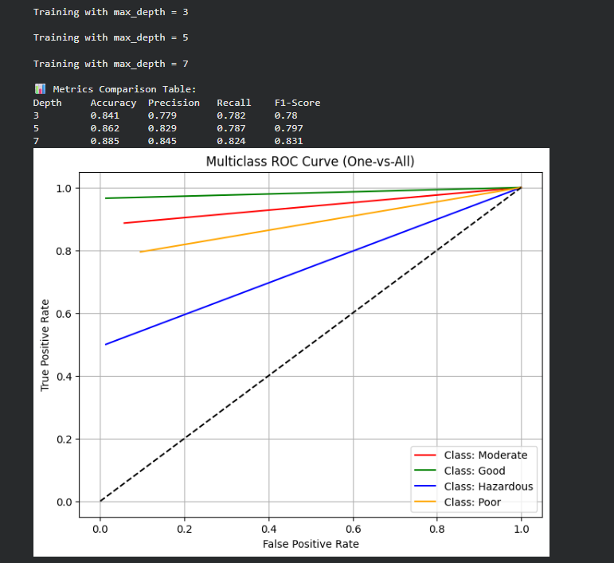

# ID3 Decision Tree for Air Quality Classification

## Overview
This project implements the ID3 decision tree algorithm from scratch to classify air quality levels using environmental features.

## Dataset
Features used:
- PM2.5
- PM10
- NO2
- CO
- Temperature
- Humidity

Target:
- Air Quality category

## Key Concepts Implemented
- Entropy calculation
- Information gain
- Best feature split selection
- Recursive decision tree building
- Manual confusion matrix
- Manual classification report
- Feature importance analysis
- ROC curve for multiclass classification

## Technologies Used
- Python
- NumPy
- Pandas
- Matplotlib
- Seaborn

## Project Structure
- id3_air_quality_decision_tree.ipynb → main implementation
- images/ → output screenshots
- requirements.txt → dependencies

## Results

### Confusion Matrix

### Feature Importance

### ROC Curve

## How to Run
1. Install dependencies:
   pip install -r requirements.txt

2. Run notebook:
   id3_air_quality_decision_tree.ipynb

## Future Improvements
- Improve tree pruning
- Deploy model as web app
- Compare with Random Forest

